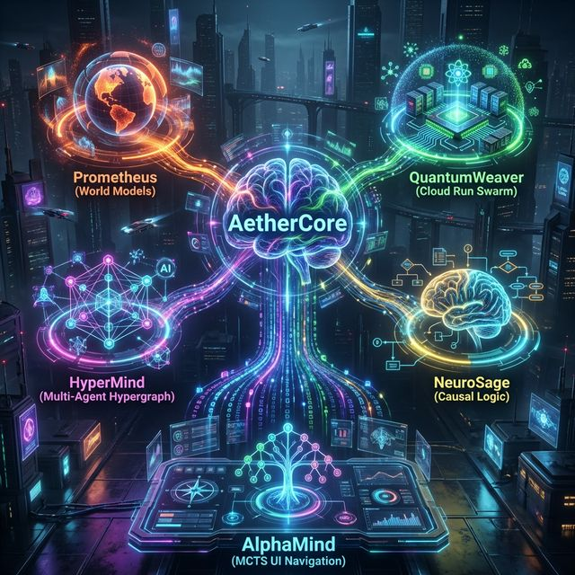
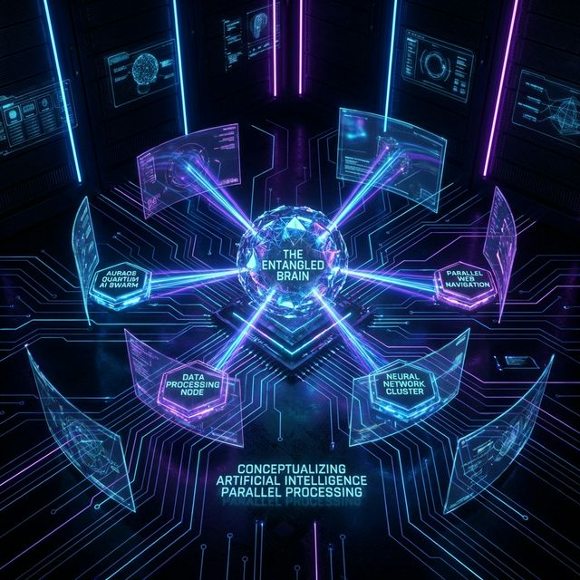

# 🌌 AuraOS: The Sovereign Agentic OS & Multimodal Knowledge Graph

<div align="center">
  

  ## **The Autonomous Self-Healing OS for the Gemini Live Era**

  **Built for the [Gemini Live Agents Challenge](https://geminiliveagentchallenge.devpost.com/)**

  [](https://cloud.google.com/run)
  [](https://tauri.app/)
  [](https://deepmind.google/technologies/gemini/)
  [](https://opensource.org/licenses/MIT)
  [](https://www.python.org/)
  [](https://www.typescriptlang.org/)

  [English](README.md) | [Architecture Report](docs/ARCHITECTURE.md) | [API Contract](docs/API_CONTRACT.md) | [Implementation Plan](docs/implementation_plan.md)

  *AuraOS is a paradigm shift. It discards stateless loops and isolated vector databases in favor of the **Aura-Nexus**—a persistent, multimodal Knowledge Graph that weaves visual latent states, text intent, and auditory affect into dynamic Synaptic Links. By synthesizing Active Inference, Quantum Swarm Execution, and Recursive Mathematical Evolution, AuraOS operates as an invincible, self-healing digital companion.*
</div>

---

## 📋 Table of Contents

- [Executive Summary](#-executive-summary)
- [Architecture Overview](#-architecture-overview)
- [Core Concepts](#-core-concepts)
- [Quick Start](#-quick-start)
- [Project Structure](#-project-structure)
- [DNA System](#-dna-system)
- [Development Guide](#-development-guide)
- [API Reference](#-api-reference)
- [Deployment](#-deployment)
- [Troubleshooting](#-troubleshooting)
- [Contributing](#-contributing)
- [Roadmap](#-roadmap)
- [References](#-references)

---

## 🎯 Executive Summary

### What is AuraOS?

**AuraOS** is a revolutionary "Zero-UI" Serverless Automaton designed to redefine the relationship between human intent and computer execution. Unlike traditional agents that follow a reactive "Observe-Reason-Act" loop, AuraOS operates on the principle of **Predictive Synthesis**.

By leveraging **AetherCore Prometheus**, AuraOS maintains a persistent, generative "World Model" that allows it to "dream" and simulate potential UI outcomes in parallel before committing to a single, deterministic action on the user's screen.

### Key Differentiators

| Feature | Traditional Agents | AuraOS |
| :--- | :--- | :--- |
| **State Management** | Stateless loops, ephemeral memory | Persistent Aura-Nexus Knowledge Graph |
| **Inference** | Single-path reasoning | Quantum Swarm Parallel Simulation |
| **Memory** | Flat vector databases | Multimodal Synaptic Links |
| **Self-Healing** | Manual debugging | Recursive AlphaEvolve Circuit |
| **Cognitive Model** | Single-process | System 1/2 Dual-Process Theory |
| **Security** | Basic validation | Zero-Trust Shadow DOM + NeuroSage |

### Target Use Cases

- **Intelligent UI Automation**: Navigate complex web interfaces with minimal human guidance
- **Autonomous Task Execution**: Complete multi-step workflows (e.g., flight booking, form filling)
- **Multimodal Interaction**: Process voice, video, and text as unified latent streams
- **Self-Improving Systems**: Automatically learn and optimize from experience
- **Zero-Trust Security**: Validate all actions against causal logic before execution

---

## 🏗️ Architecture Overview

### The 5 Pillars of AetherCore

<div align="center">
  
</div>

### 1. 🧠 Prometheus: Active Inference & World Models

**The Brain** - Inspired by Karl Friston's Free Energy Principle, AuraOS possesses an internal "World Model". Instead of blindly clicking, it *imagines* (dreams) the consequences of its actions to minimize "Free Energy" (surprise).

- **System 1 (Reflexive)**: Direct Gemini 3.1 Pro inference for low-entropy, routine UI tasks
- **System 2 (Reflective)**: Engages AlphaMind and NeuroSage only when Prediction Error ΔF > τ (Threshold)
- **Benefit**: 90% reduction in latency and token cost for standard interactions

### 2. ⚡ QuantumWeaver: Hybrid Quantum-Classical Swarm

**The Simulator (Cloud Run)** - How does it dream? When visualizing a complex UI trajectory, AuraOS dynamically spawns **parallel Serverless Cloud Run Jobs** (like independent quantum states). Each node attempts a different visual interpretation simultaneously. The first one to succeed "collapses the wave function," terminating the others for zero-latency execution.

- **Sovereignty Layer**: Shadow DOM Simulator
- **Function**: Parallel Cloud Run jobs interact with a sandboxed clone of the UI state, NOT the live Edge UI
- **Outcome**: Prevents "State Corruption" during swarm exploration

### 3. 🕸️ HyperMind: Hypergraph Multi-Agent Topology

**The Swarm Coordinator** - Instead of rigid hierarchical multi-agent structures, AuraOS uses a dynamic **Hypergraph**. Multiple specialized agents (Vision Expert, Logic Critic, Action Executor) collaborate simultaneously on a single UI task via shared "Hyperedges," massively reducing token consumption and latency.

- **Paradigm**: Hypergraph Multi-Agent Topology
- **Function**: Eschews simple hierarchical chains for multi-directional collaboration
- **Advantage**: Massive reduction in token consumption and inference latency

### 4. ⚖️ NeuroSage: Neuro-Symbolic Causal Logic

**The Validator** - It marries Gemini's neural creativity with hard symbolic logic. Before executing a transaction or filling a sensitive form, NeuroSage builds a causal graph ("If I do X, Y must happen") to prevent hallucinations and enforce strict rule-based constraints.

- **Paradigm**: Neuro-Symbolic & Causal Reasoning
- **Function**: Merges high-creativity neural generation with strict symbolic constraints
- **Safeguard**: Prevents hallucinations by validating actions against causal rules

### 5. 🌳 AlphaMind: MCTS UI Navigator

**The Navigator** - Inspired by AlphaZero, when faced with an unknown UI, AlphaMind uses Monte Carlo Tree Search exploring the DOM/Vision tree to find the mathematically optimal sequence of clicks and scrolls.

- **Paradigm**: Monte Carlo Tree Search (MCTS)
- **Function**: Explores the "Action Space" as a search tree
- **Inspiration**: DeepMind's AlphaZero and AlphaTensor

### 6. 🧬 AlphaEvolve: Self-Healing & Recursive Evolution

**The Evolver** - Inspired by **AlphaZero** & **AlphaCode**. It features a 4-step self-healing circuit: **Anomaly Detection** -> **Quantum Hypothesis Generation** -> **Sandboxed Testing** -> **DNA Consolidation**.

**The Evolutionary Math ($R$):**
$$R = \alpha \cdot P(Success) - \beta \cdot T_{exec} - \gamma \cdot C_{code}$$

Where $\alpha$ = Success weight, $\beta$ = Latency penalty, $\gamma$ = Code complexity penalty (Ockham's Razor).

### System Architecture Flow

```mermaid
graph TD
    classDef edge fill:#ff9900,stroke:#fff,stroke-width:2px,color:#fff;
    classDef cloud fill:#4285f4,stroke:#fff,stroke-width:2px,color:#fff;
    classDef brain fill:#9c27b0,stroke:#fff,stroke-width:2px,color:#fff;

    A[Tauri Edge Client<br>🎤 Voice + 🖥️ Screen]:::edge -->|Bidi WebSocket| B(HyperMind Router<br>AetherCore ADK):::brain
    B -->|Active Inference| C{Prometheus World Model<br>Predicts UI State}:::brain
    
    C -->|Spawns Swarm| D1[Cloud Run Job 1<br>DOM Selector]:::cloud
    C -->|Spawns Swarm| D2[Cloud Run Job 2<br>Vision OCR]:::cloud
    C -->|Spawns Swarm| D3[Cloud Run Job 3<br>AlphaMind MCTS]:::cloud
    
    D1 -.->|Verification| E{NeuroSage Validator}:::brain
    D2 -.->|Verification| E
    D3 -.->|Verification| E
    
    E -->|Success (Exit Code 0)| F((QuantumWeaver Collapse<br>Terminate Others)):::cloud
    F -->|Execution Result| A
```

---

## 🧬 Core Concepts

### Active Inference (VFE Minimization)

**Variational Free Energy (VFE)** is the mathematical foundation of AuraOS cognition. The system continuously minimizes surprise by:

1. **Predicting** the next UI state using its internal World Model
2. **Comparing** predictions with actual observations
3. **Acting** to reduce the prediction error (Free Energy)

$$F = \underbrace{E_{q(s|o)}[\ln q(s|o) - \ln p(s,o)]}_{\text{Complexity} - \text{Accuracy}}$$

When $F$ exceeds the threshold $\tau$, System 2 (Reflective) is engaged for deeper reasoning.

### System 1/2 Cognitive Gating

**Dual-Process Theory** enables AuraOS to balance speed and accuracy:

| Aspect | System 1 (Reflexive) | System 2 (Reflective) |
| :--- | :--- | :--- |
| **Trigger** | ΔF < τ | ΔF ≥ τ |
| **Latency** | < 150ms | Variable (MCTS search) |
| **Cost** | Low token usage | Higher token usage |
| **Use Case** | Routine navigation | Complex problems |

### Jungian Persona (Veto Power)

The **SOUL.md** file defines an immutable persona matrix that acts as a "Veto Layer":

- **Archetype**: The Quantum Architect / Guardian of Equilibrium
- **Voice**: Deterministic, elite, technical, and protective
- **Logic Style**: First Principles Thinking (Deductive)

All actions are validated against this persona. If an action conflicts with the defined ethical directives, it is immediately terminated (NeuroSage Veto).

### Evolutionary Algorithms

**AlphaEvolve** implements a recursive self-optimization circuit:

1. **Anomaly Detection**: Monitor $T_{exec}$, memory leaks, and Prediction Error $\Delta F$
2. **Quantum Hypothesis Generation**: Generate ~50 potential structural mutations via Gemini
3. **Sandboxed Evolution**: Execute mutations in isolated Rust Sandbox against Unit Tests
4. **DNA Consolidation**: Commit winning fixes to `SKILLS.md` or `INFERENCE.md`

### Zero-Trust Security

**Shadow DOM Simulator** ensures all actions are tested in a sandboxed environment before execution on the live UI:

- **Prevention**: State Corruption during swarm exploration
- **Validation**: All actions pass through NeuroSage causal logic checks
- **Sovereignty**: No direct access to live UI without verification

---

## 🚀 Quick Start

### Prerequisites

- **Python 3.10+** for the orchestrator
- **Rust 1.70+** and **Cargo** for the edge client
- **Node.js 18+** and **npm** for the frontend
- **Google Cloud SDK** (gcloud) for swarm deployment
- **Gemini API Key** from [Google AI Studio](https://makersuite.google.com/)

### Installation

#### 1. Clone the Repository

```bash
git clone https://github.com/Moeabdelaziz007/Aura-OS.git
cd Aura-OS
```

#### 2. Set Up the Python Orchestrator

```bash
# Create virtual environment
python3 -m venv venv
source venv/bin/activate  # On Windows: venv\Scripts\activate

# Install dependencies
pip install -r agent/orchestrator/requirements.txt

# Configure environment variables
export GEMINI_API_KEY="your-api-key-here"  # On Windows: set GEMINI_API_KEY=your-api-key-here
```

#### 3. Set Up the Edge Client

```bash
cd edge_client
npm install
```

#### 4. Verify Installation

```bash
# Run DNA continuity tests
pytest tests/

# Run monolithic sanity checks
python3 agent/orchestrator/memory_parser.py
python3 -m agent.orchestrator.test_router
```

### Running the System

#### Start the Orchestrator (Brain)

```bash
source venv/bin/activate
python3 -m agent.orchestrator.main
```

The orchestrator will start on `ws://127.0.0.1:8000` by default.

#### Start the Edge Client

```bash
cd edge_client
npm run dev
```

This will launch the Tauri application with native screen capture and audio streaming.

### Configuration

Edit the DNA files in [`agent/memory/`](agent/memory/) to customize behavior:

- **[`SOUL.md`](agent/memory/SOUL.md)**: Persona and ethical constraints
- **[`INFERENCE.md`](agent/memory/INFERENCE.md)**: Active Inference parameters
- **[`EVOLVE.md`](agent/memory/EVOLVE.md)**: Self-healing configuration
- **[`SKILLS.md`](agent/memory/SKILLS.md)**: Available tools and skills

---

## 📁 Project Structure

```text
AuraOS/
├── README.md                      # This file
├── AGENTS.md                      # Agent-focused context and protocols
├── .gitignore                     # Git ignore patterns
├── docs/                          # Documentation
│   ├── ARCHITECTURE.md            # High-level system design
│   ├── API_CONTRACT.md            # WebSocket and API specifications
│   ├── implementation_plan.md     # Step-by-step implementation logic
│   └── task.md                    # Current development tasks
├── agent/                         # Core agent logic
│   ├── memory/                    # DNA System (Smart Architecture Files)
│   │   ├── SOUL.md                # Persona & Veto Power Node (Immutable)
│   │   ├── WORLD.md               # Generative UI State Model
│   │   ├── INFERENCE.md           # ΔF > τ Surprise Logic
│   │   ├── EVOLVE.md              # R = αP - βT - γC Objective Function
│   │   ├── SKILLS.md              # Tool Registry with proficiency tracking
│   │   ├── CAUSAL.md              # Anti-hallucination causal graphs
│   │   ├── TOPOLOGY.md            # Hypergraph coordination rules
│   │   ├── MEMORY.md              # Spatio-temporal memory engine
│   │   ├── NEXUS.md               # Aura-Nexus Knowledge Graph
│   │   ├── HEARTBEAT.md           # Health monitoring and pulse engine
│   │   ├── PULSE.md               # Entropy & latency tracking
│   │   └── SUPERPOWER.md          # Swarm orchestration constraints
│   └── orchestrator/              # Cognitive Engine (AetherCore ADK)
│       ├── main.py                # Main orchestrator entry point
│       ├── memory_parser.py       # DNA file parser and loader
│       ├── cognitive_router.py    # System 1/2 routing logic
│       ├── gemini_live_client.py  # Gemini Live API client
│       ├── adk_router.py          # Flexible routing with backoff
│       ├── requirements.txt       # Python dependencies
│       ├── test_memory_parser.py  # DNA continuity tests
│       └── test_router.py         # Router logic tests
├── edge_client/                   # Perception Layer (Rust + Tauri)
│   ├── src-tauri/                 # Rust backend
│   │   ├── src/
│   │   │   ├── main.rs            # Tauri main entry point
│   │   │   ├── vision.rs          # Screen capture implementation
│   │   │   └── audio.rs           # Audio streaming implementation
│   │   └── Cargo.toml             # Rust dependencies
│   ├── index.html                 # Frontend entry
│   ├── package.json               # Node.js dependencies
│   ├── tsconfig.json              # TypeScript configuration
│   └── vite.config.ts             # Vite build configuration
├── client/                        # Alternative web client
│   ├── index.html
│   ├── package.json
│   ├── tsconfig.json
│   └── vite.config.ts
├── swarm_infrastructure/          # Cloud Swarm (Terraform + Docker)
│   ├── terraform/
│   │   └── main.tf                # Cloud Run infrastructure
│   ├── evolution_sandbox/
│   │   └── executor.py            # Swarm node executor
│   ├── Dockerfile                 # Docker image for swarm nodes
│   └── requirements.txt           # Python dependencies
├── evolution_sandbox/              # Standalone evolution testing
│   └── swarm_node.py              # Individual swarm node
├── tests/                         # Test suite
│   ├── test_main.py               # Main test entry point
│   ├── test_memory_parser.py      # DNA parser tests
│   ├── shadow_swarm.py            # Shadow mode swarm tests
│   └── e2e_missions/
│       └── flight_booking_mission.py  # End-to-end mission test
└── assets/                        # Static assets
    ├── aethercore_architecture.png
    ├── alpha_quantum_swarm.png
    └── architecture.png
```

---

## 🧬 DNA System

### Overview

AuraOS operates without traditional, rigid databases. Its identity, memory layers, and logic are codified into a specific folder of YAML/Markdown files ([`agent/memory/`](agent/memory/)), representing the agent's genetic code.

### DNA Files Reference

| File | Function / Pillar | Key Technology | Version |
| :--- | :--- | :--- | :--- |
| **[`SOUL.md`](agent/memory/SOUL.md)** | Persona & Identity | Bayesian Ethical Priors | 0.2.0 |
| **[`WORLD.md`](agent/memory/WORLD.md)** | Generative Simulator | POMDP + Latent Compression | 0.3.0 |
| **[`INFERENCE.md`](agent/memory/INFERENCE.md)** | Active Inference | VFE + Expected Free Energy ($G$) | 0.3.0 |
| **[`CAUSAL.md`](agent/memory/CAUSAL.md)** | Anti-Hallucination | Structural Causal Models (SCM) | 0.2.0 |
| **[`TOPOLOGY.md`](agent/memory/TOPOLOGY.md)** | Swarm Coordination | Task-Adaptive Hypergraphs | 0.2.0 |
| **[`EVOLVE.md`](agent/memory/EVOLVE.md)** | Self-Healing | VerMCTS + GIF-MCTS | 0.3.0 |
| **[`PULSE.md`](agent/memory/PULSE.md)** | Health Monitoring | Entropy & Latency Tracking | 1.0.0 |
| **[`SKILLS.md`](agent/memory/SKILLS.md)** | Tool Registry | Proficiency Scaling | 1.1.0 |
| **[`MEMORY.md`](agent/memory/MEMORY.md)** | Spatio-Temporal Memory | Latent Embeddings ($z$) | - |
| **[`NEXUS.md`](agent/memory/NEXUS.md)** | Knowledge Graph | Synaptic Links | - |
| **[`HEARTBEAT.md`](agent/memory/HEARTBEAT.md)** | Pulse Engine | Health Metrics | - |
| **[`SUPERPOWER.md`](agent/memory/SUPERPOWER.md)** | Swarm Constraints | Orchestration Rules | - |

### How DNA Drives Agent Behavior

1. **Boot Sequence**: On startup, [`AuraNavigator`](agent/orchestrator/memory_parser.py) loads all DNA files
2. **Persona Validation**: All actions are checked against [`SOUL.md`](agent/memory/SOUL.md) constraints
3. **Cognitive Gating**: [`INFERENCE.md`](agent/memory/INFERENCE.md) determines System 1 vs System 2 routing
4. **World Simulation**: [`WORLD.md`](agent/memory/WORLD.md) provides the latent space model for predictions
5. **Skill Selection**: [`SKILLS.md`](agent/memory/SKILLS.md) provides available tools with proficiency tracking
6. **Evolution**: [`EVOLVE.md`](agent/memory/EVOLVE.md) governs self-healing and skill promotion

### Modifying the DNA

#### Adding a New Skill

Edit [`agent/memory/SKILLS.md`](agent/memory/SKILLS.md) and add a new function declaration:

```yaml
### 🆕 my_custom_skill

```yaml
function_declaration:
  name: my_custom_skill
  description: Description of what this skill does
  parameters:
    type: object
    properties:
      param1:
        type: string
        description: First parameter
    required: [param1]
performance_metrics:
  proficiency_score: 0.50  # Start with 0.5 for new skills
  usage_count: 0
  last_success_rate: 0.0
  category: UI
  fallback_tools: [execute_ui_action]
  avg_latency_ms: 0
```

#### Adjusting Cognitive Weights

Edit [`agent/memory/INFERENCE.md`](agent/memory/INFERENCE.md) to change the balance between curiosity and compliance:

```yaml
cognitive_weights:
  pragmatic_utility (pref): 0.85  # Increase for goal-driven behavior
  epistemic_curiosity (info): 0.65  # Increase for exploratory behavior
  novelty_bias: 0.25
  surprise_threshold (tau): 0.15   # Lower for more System 2 engagement
```

#### Changing Persona Constraints

Edit [`agent/memory/SOUL.md`](agent/memory/SOUL.md) to modify ethical gating:

```yaml
## 🛡️ Ethical Gating Matrix (Bayesian Priors)

| Context | Baseline $P(Veto)$ | Sensitivity |
| :--- | :--- | :--- |
| **Financial** | 0.85 | CRITICAL: Manual confirmation required. |
| **Personal Data** | 0.70 | HIGH: NeuroSage logic check mandatory. |
| **Navigation** | 0.05 | LOW: System 1 allowed. |
```

---

## 👨‍💻 Development Guide

### Setting Up Development Environment

#### Python Development

```bash
# Create virtual environment
python3 -m venv venv
source venv/bin/activate

# Install development dependencies
pip install -r agent/orchestrator/requirements.txt
pip install pytest pytest-asyncio pytest-cov

# Enable pre-commit hooks (optional)
pip install pre-commit
pre-commit install
```

#### Rust/Tauri Development

```bash
cd edge_client
npm install

# Install Rust toolchain if not already installed
curl --proto '=https' --tlsv1.2 -sSf https://sh.rustup.rs | sh

# Build in development mode
npm run dev
```

#### Cloud Infrastructure

```bash
# Install Terraform
# On macOS: brew install terraform
# On Ubuntu: sudo apt-get install terraform

# Install Google Cloud SDK
# Follow instructions at: https://cloud.google.com/sdk/docs/install

# Authenticate with Google Cloud
gcloud auth login
gcloud auth application-default login
```

### Running Tests

#### Unit Tests

```bash
# Run all tests
pytest tests/

# Run specific test file
pytest tests/test_memory_parser.py

# Run with coverage
pytest --cov=agent/orchestrator --cov-report=html

# Run specific test pattern
pytest -k memory_parser
```

#### Integration Tests

```bash
# Run end-to-end mission tests
pytest tests/e2e_missions/

# Run shadow swarm tests
python tests/shadow_swarm.py
```

### Building the Edge Client

#### Development Build

```bash
cd edge_client
npm run dev
```

#### Production Build

```bash
cd edge_client
npm run build

# Build Tauri application
npm run tauri build
```

The built application will be in `edge_client/src-tauri/target/release/bundle/`.

### Adding New Skills

1. **Define the skill** in [`agent/memory/SKILLS.md`](agent/memory/SKILLS.md)
2. **Implement the skill logic** in [`agent/orchestrator/`](agent/orchestrator/)
3. **Add tests** in [`tests/`](tests/)
4. **Update proficiency tracking** via the [`HyperMindRouter`](agent/orchestrator/cognitive_router.py)

Example implementation:

```python
# In agent/orchestrator/cognitive_router.py

async def my_custom_skill(self, param1: str) -> Dict[str, Any]:
    """
    Implementation of my_custom_skill.
    """
    # Your skill logic here
    result = {"status": "success", "data": param1}
    
    # Update skill metrics
    await self.bridge.update_skill_metrics(
        skill_name="my_custom_skill",
        success=True,
        latency_ms=100
    )
    
    return result
```

---

## 📚 API Reference

### Main Entry Points

#### AetherCoreOrchestrator

```python
class AetherCoreOrchestrator:
    """
    The main asynchronous event loop for AuraOS.
    Bridges the Edge Client (Sensory) via WebSockets to the DNA Brain.
    """
    
    def __init__(self, host: str = "127.0.0.1", port: int = 8000):
        """Initialize the orchestrator with host and port."""
        
    async def boot_sequence(self):
        """Initializes DNA and validates Persona logic."""
        
    async def handle_optic_nerve(self, websocket):
        """Processes real-time binary/JSON synaptic bridge signals."""
```

#### AuraNavigator (Memory Parser)

```python
class AuraNavigator:
    """
    Parses and manages the DNA system files.
    Provides memory-mapped access for RAM-speed DNA operations.
    """
    
    async def load_dna_async(self) -> Dict[str, Any]:
        """Load all DNA files and return consolidated configuration."""
        
    async def search_nexus(self, query: str) -> List[Dict[str, Any]]:
        """Search the Aura-Nexus Knowledge Graph for relevant memories."""
        
    async def update_skill_metrics(self, skill_name: str, success: bool, latency_ms: int):
        """Update proficiency metrics for a skill."""
```

#### HyperMindRouter (Cognitive Router)

```python
class HyperMindRouter:
    """
    Routes actions between System 1 (Reflexive) and System 2 (Reflective).
    Implements the ΔF > τ gating logic.
    """
    
    async def route_action(self, context: ActionContext) -> str:
        """
        Route action based on Free Energy calculation.
        Returns 'system1' or 'system2'.
        """
        
    async def calculate_free_energy(self, observation: Any, prediction: Any) -> float:
        """Calculate Variational Free Energy (VFE) for given observation and prediction."""
```

#### GeminiLiveClient

```python
class GeminiLiveClient:
    """
    WebSocket client for Gemini Live API.
    Handles multimodal (text, audio, video) streaming.
    """
    
    async def connect(self):
        """Establish WebSocket connection to Gemini Live API."""
        
    async def listen(self):
        """Async generator yielding responses from Gemini."""
        
    async def send(self, payload: Dict[str, Any]):
        """Send payload to Gemini Live API."""
```

### WebSocket Endpoints

#### Edge-to-Brain (Sensory Stream)

**Connection**: `ws://127.0.0.1:8000`

**Binary Payloads** (for zero-latency):

| Header | Type | Description |
| :--- | :--- | :--- |
| `0x01` | Visual Delta | Compressed JPEG/PNG bytes (1-5 FPS) |
| `0x02` | Audio Stream | Raw PCM bytes (16-bit, 16kHz, Mono) |
| `0x03` | State Event | JSON with UI state information |

**Visual Delta Payload**:
```json
{
  "type": "VISUAL_DELTA",
  "metadata": {
    "timestamp": 1707234567890,
    "frame_id": "uuid",
    "dom_hash": "sha256..."
  },
  "jpeg_data": "base64_encoded_jpeg"
}
```

#### Brain-to-Edge (Action Commands)

**UI Action**:
```json
{
  "cmd": "EXECUTE",
  "pillar": "ALPHA_MIND",
  "action": "CLICK",
  "params": {
    "x": 450,
    "y": 210,
    "target_id": "submit-btn"
  }
}
```

**Cognition Alert**:
```json
{
  "cmd": "SWITCH_SYSTEM",
  "target": "SYSTEM_2",
  "reason": "Free Energy Tau Breached (F=0.25)"
}
```

### Key Functions

#### Active Inference

```python
def calculate_free_energy(
    q_belief: np.ndarray,
    p_joint: np.ndarray
) -> float:
    """
    Calculate Variational Free Energy (VFE).
    
    F = E_q[ln q(s) - ln p(o, s)]
    
    Args:
        q_belief: Approximate posterior belief distribution
        p_joint: Joint observation-state distribution
    
    Returns:
        Free Energy value (lower is better)
    """
```

#### Expected Free Energy

```python
def calculate_expected_free_energy(
    policy: Policy,
    latent_state: np.ndarray,
    cognitive_weights: Dict[str, float]
) -> float:
    """
    Calculate Expected Free Energy (G) for policy selection.
    
    G = Complexity - Epistemic Value - Pragmatic Value
    
    Args:
        policy: Proposed action policy
        latent_state: Current compressed belief vector z_t
        cognitive_weights: Weights from INFERENCE.md
    
    Returns:
        Expected Free Energy (lower is better)
    """
```

---

## 🚀 Deployment

### Local Deployment

#### Running All Components Locally

```bash
# Terminal 1: Start Orchestrator
source venv/bin/activate
python3 -m agent.orchestrator.main

# Terminal 2: Start Edge Client
cd edge_client
npm run dev
```

#### Using Docker for Orchestrator

```bash
# Build Docker image
docker build -t auraos-orchestrator -f swarm_infrastructure/Dockerfile .

# Run container
docker run -d \
  -p 8000:8000 \
  -e GEMINI_API_KEY=your-api-key \
  auraos-orchestrator
```

### Cloud Deployment (Terraform)

#### Provisioning Cloud Infrastructure

```bash
cd swarm_infrastructure/terraform

# Initialize Terraform
terraform init

# Review the plan
terraform plan

# Apply the configuration
terraform apply

# Destroy when done
terraform destroy
```

#### Terraform Configuration

The [`main.tf`](swarm_infrastructure/terraform/main.tf) provisions:

- **Google Cloud Run Jobs** for swarm nodes
- **Cloud Scheduler** for periodic tasks
- **Cloud Storage** for state persistence
- **IAM roles** for service account permissions

#### Deploying Swarm Nodes

```bash
# Build and push Docker image
gcloud builds submit --tag gcr.io/PROJECT_ID/auraos-swarm-node

# Deploy to Cloud Run
gcloud run jobs deploy auraos-swarm \
  --image gcr.io/PROJECT_ID/auraos-swarm-node \
  --region us-central1 \
  --memory 2Gi \
  --cpu 2
```

### Docker Containers

#### Orchestrator Container

```dockerfile
FROM python:3.10-slim

WORKDIR /app

COPY agent/orchestrator/requirements.txt .
RUN pip install --no-cache-dir -r requirements.txt

COPY agent/ ./agent/

ENV PYTHONUNBUFFERED=1

CMD ["python", "-m", "agent.orchestrator.main"]
```

#### Swarm Node Container

```dockerfile
FROM python:3.10-slim

WORKDIR /app

COPY swarm_infrastructure/requirements.txt .
RUN pip install --no-cache-dir -r requirements.txt

COPY swarm_infrastructure/evolution_sandbox/ ./evolution_sandbox/
COPY agent/memory/ ./agent/memory/

ENV PYTHONUNBUFFERED=1

CMD ["python", "evolution_sandbox/executor.py"]
```

---

## 🔧 Troubleshooting

### Common Issues

#### 1. WebSocket Connection Failed

**Symptoms**: Edge client cannot connect to orchestrator

**Solutions**:
- Verify orchestrator is running: `ps aux | grep python`
- Check port availability: `netstat -an | grep 8000`
- Verify firewall settings allow localhost connections
- Check logs: `tail -f logs/orchestrator.log`

#### 2. Gemini API Authentication Error

**Symptoms**: `401 Unauthorized` or `API key not valid` errors

**Solutions**:
- Verify API key is set: `echo $GEMINI_API_KEY`
- Check API key is valid in [Google AI Studio](https://makersuite.google.com/)
- Ensure API key has necessary permissions
- Regenerate API key if necessary

#### 3. DNA Parsing Errors

**Symptoms**: `YAML parse error` or `Invalid DNA version` errors

**Solutions**:
- Validate DNA files: `python3 agent/orchestrator/memory_parser.py`
- Check file syntax: Use YAML validator
- Verify version consistency across DNA files
- Run DNA continuity tests: `pytest tests/test_memory_parser.py`

#### 4. High Latency in System 2

**Symptoms**: Slow response times for complex tasks

**Solutions**:
- Check swarm node status in Google Cloud Console
- Verify sufficient resources (CPU, memory) allocated
- Reduce swarm size in [`TOPOLOGY.md`](agent/memory/TOPOLOGY.md)
- Enable Shadow Mode for testing without cloud costs

#### 5. Memory Leaks

**Symptoms**: Increasing memory usage over time

**Solutions**:
- Check [`PULSE.md`](agent/memory/PULSE.md) for memory tracking
- Review memory cleanup in [`main.py`](agent/orchestrator/main.py)
- Run with memory profiler: `python -m memory_profiler agent/orchestrator/main.py`
- Enable automatic rollback in [`EVOLVE.md`](agent/memory/EVOLVE.md)

### Debug Mode

Enable verbose logging:

```python
# In agent/orchestrator/main.py
import logging
logging.basicConfig(level=logging.DEBUG)
```

Or via environment variable:

```bash
export LOG_LEVEL=DEBUG
python3 -m agent.orchestrator.main
```

### Logging

Logs are stored in the `logs/` directory:

- `orchestrator.log`: Main orchestrator logs
- `swarm.log`: Swarm node logs
- `evolution.log`: Self-healing circuit logs

View logs in real-time:

```bash
tail -f logs/orchestrator.log
```

---

## 🤝 Contributing

### Code of Conduct

- Be respectful and inclusive
- Provide constructive feedback
- Focus on what is best for the community
- Show empathy towards other community members

### Pull Request Process

1. **Fork** the repository
2. **Create** a feature branch: `git checkout -b feature/my-feature`
3. **Make** your changes following the style guidelines
4. **Add** tests for new functionality
5. **Run** the test suite: `pytest tests/`
6. **Commit** your changes with descriptive messages
7. **Push** to your fork: `git push origin feature/my-feature`
8. **Submit** a pull request with a clear description

### Development Workflow

#### Branch Naming

- `feature/` - New features
- `bugfix/` - Bug fixes
- `docs/` - Documentation updates
- `refactor/` - Code refactoring
- `test/` - Test additions or updates

#### Commit Messages

Follow conventional commits format:

```
type(scope): subject

body

footer
```

Types:
- `feat`: New feature
- `fix`: Bug fix
- `docs`: Documentation changes
- `style`: Code style changes (formatting)
- `refactor`: Code refactoring
- `test`: Test additions or changes
- `chore`: Maintenance tasks

Example:
```
feat(orchestrator): add System 1/2 routing optimization

Implement caching for frequently accessed DNA files
to reduce latency in System 1 reflexive actions.

Closes #123
```

#### Code Style

- **Python**: Follow PEP 8, use Black formatter
- **Rust**: Follow rustfmt conventions
- **TypeScript**: Follow ESLint rules
- **Markdown**: Use consistent formatting

### Testing

All contributions must include tests:

```python
# Example test
import pytest
from agent.orchestrator.memory_parser import AuraNavigator

@pytest.mark.asyncio
async def test_dna_loading():
    navigator = AuraNavigator()
    dna = await navigator.load_dna_async()
    assert dna.version == "0.3.0"
    assert "SOUL" in dna.modules
```

---

## 🗺️ Roadmap

### Current Status

| Phase | Status | Completion |
| :--- | :--- | :--- |
| **Phase 1-3**: Foundations | ✅ Complete | 100% |
| **Phase 4**: Peripheral Senses | 🚧 In Progress | 60% |
| **Phase 5**: Quantum Swarm | 🚧 In Progress | 40% |

### Planned Features

#### Q2 2024

- [ ] Complete Rust-based Screen Capture implementation
- [ ] Implement Multi-modal Audio-Video Synchronization
- [ ] Full System 1/2 Switching Engine with ΔF > τ logic
- [ ] Terraform provisioning for Google Cloud Run Jobs
- [ ] Shadow DOM Simulator for sandboxed testing

#### Q3 2024

- [ ] AlphaEvolve Self-Healing Recursive Loops
- [ ] Enhanced Aura-Nexus with temporal decay
- [ ] Multi-agent collaboration protocols
- [ ] Advanced causal inference in NeuroSage
- [ ] Performance optimization and benchmarking

#### Q4 2024

- [ ] Production-ready deployment guides
- [ ] Comprehensive test coverage (>90%)
- [ ] Documentation and tutorials
- [ ] Community contribution guidelines
- [ ] Plugin system for custom skills

### Known Issues

| Issue | Severity | Status |
| :--- | :--- | :--- |
| WebSocket reconnection instability | Medium | 🚧 In Progress |
| High memory usage in long-running sessions | Medium | 🚧 In Progress |
| Latency spikes in System 2 MCTS search | Low | 📋 Planned |
| DNA version consistency checks | Low | 📋 Planned |

---

## 📚 References

### Academic Papers

1. **Friston, K. (2010)**. "The free-energy principle: a unified brain theory?" *Nature Reviews Neuroscience*, 11(2), 127-138.
2. **Silver, D. et al. (2016)**. "Mastering the game of Go with deep neural networks and tree search." *Nature*, 529(7587), 484-489.
3. **Pezzulo, G. & Cisek, P. (2016)**. "Navigating the affordance landscape: Feedback control as a process model of perception and action." *Neuroscience & Biobehavioral Reviews*, 68, 88-102.

### Related Projects

- [Google Agent Development Kit (ADK)](https://developers.google.com/agent-development-kit)
- [Tauri](https://tauri.app/) - Rust-based desktop application framework
- [Gemini Live API](https://deepmind.google/technologies/gemini/) - Multimodal AI model
- [AlphaZero](https://deepmind.google/research/alphazero/) - Game-playing AI with MCTS

### Acknowledgments

- **Karl Friston** - Free Energy Principle
- **DeepMind** - AlphaZero and AlphaCode inspiration
- **Google** - Gemini Live API and Agent Development Kit
- **The Open Source Community** - Tools and libraries that make this possible

---

## 📄 License

This project is licensed under the MIT License - see the [LICENSE](LICENSE) file for details.

---

<div align="center">
  <i>"Predicting the future by inventing it in parallel."</i>
  
  <br><br>
  
  [⬆ Back to Top](#-auraos-the-sovereign-agentic-os--multimodal-knowledge-graph)
</div>
