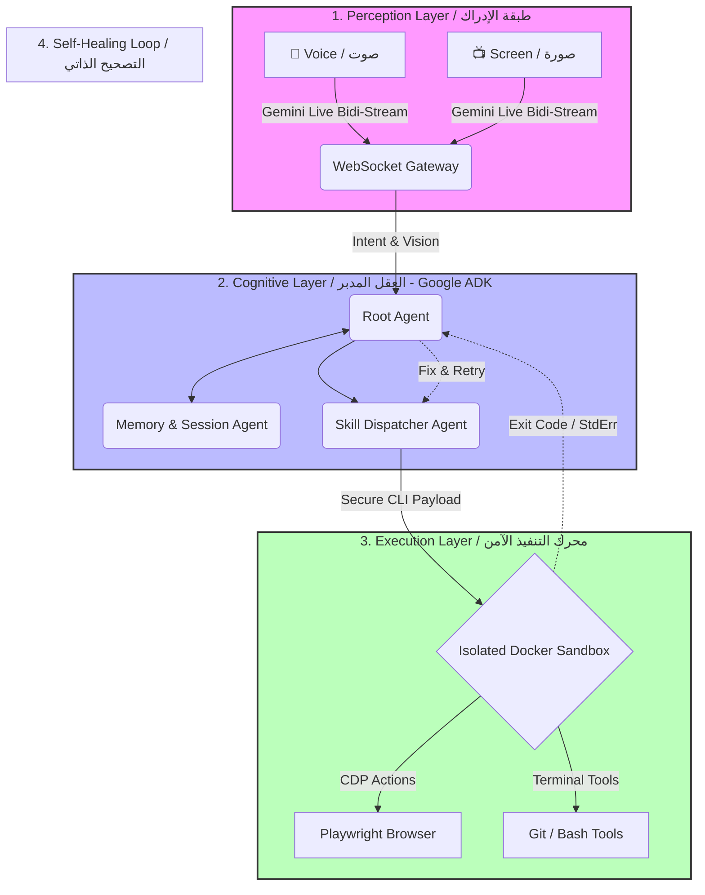

  

# 🌌 AuraOS: The "Zero-UI" DevOps & Growth Automaton

### **نظام التشغيل الصوتي المستقل لمعالجة الواجهات وأتمتة المهام المعقدة**

  **Built for the [Gemini Live Agents Challenge](https://geminiliveagentchallenge.devpost.com/)**

  
  
  
  

  *AuraOS bridges the gap between neural visual perception (Vision API) and deterministic system execution (CLI/Playwright CDP).*
  *يقوم AuraOS بسد الفجوة بين الإدراك البصري العصبي (عبر Gemini Vision API) والتنفيذ الحتمي للأنظمة (عبر بروتوكول CDP لمتصفح Playwright وأوامر سطر الأوامر)، مما يتيح لك إدارة أنظمة حية بمجرد التحدث والمقاطعة الصوتية المستمرة.*

---

## 🛑 The Problem / المشكلة: هشاشة وكلاء الواجهات (UI Navigators Fragility)

### 🇬🇧 English

Current "Computer-using Agents" try to imitate human behavior by visually tracking coordinates and simulating mouse clicks (`X, Y` mapping). This creates fragile, unreliable workflows that instantly break if a website changes a button color, repositions a div, or alters screen resolution. In enterprise environments, **this fragility is unacceptable.**

### 🇦🇪 العربية

الوكلاء الآليون الحاليون الذين يستخدمون الحواسيب يعتمدون على تقليد السلوك البشري عبر محاكاة النقرات الرسومية وتتبع الإحداثيات البصرية (نظام X,Y). هذا النهج يخلق سير عمل شديد الهشاشة؛ إذ ينهار النظام فوراً إذا قام الموقع بتغيير لون زر، أو تحريك عنصر، أو حتى تغيير دقة الشاشة. في بيئات الشركات الكبرى والأتمتة المعقدة، **هذه الهشاشة تعتبر كارثة هندسية.**

---

## 🎯 The Solution / الحل: معمارية الإدراك المفصول (Neuro-Symbolic Architecture)

### 🇬🇧 English

**AuraOS** completely abandons the "click-simulation" approach. Instead, it utilizes a **Neuro-Symbolic Architecture**:

1. **Perception (Neural):** AuraOS *sees* the screen via the Gemini Live API, leveraging its massive context window and reasoning capabilities to understand the state of the application.
2. **Execution (Symbolic):** Instead of clicking blindly, AuraOS translates its visual understanding into precise, error-resistant **Command Line Interface (CLI)** commands (e.g., executing Playwright CDP scripts for guaranteed browser interactions, or modifying Code via sed/grep) inside an isolated Docker sandbox.

### 🇦🇪 العربية

يتخلى مشروع **AuraOS** تماماً عن نهج "محاكاة النقرات". وبدلاً من ذلك، يستخدم **معمارية هجينة (عصبية-رمزية)**:

1. **الإدراك (الجانب العصبي/Neural):** يرى AuraOS الشاشة عبر واجهة Gemini Live API، مستفيداً من الرؤية المتقدمة ونافذة السياق الضخمة لفهم "الحالة" الفعلية للمشروع أو النظام.
2. **التنفيذ (الجانب الرمزي/Symbolic):** بدلاً من النقر العشوائي، يترجم النظام فهمه البصري إلى أوامر سطر أوامر (CLI) دقيقة وصارمة — مثل تنفيذ أوامر بروتوكول (Chrome DevTools Protocol - CDP) الموثوق للتفاعل مع المتصفح، أو أوامر `bash` لتعديل الملفات بدقة داخل بيئة (Docker) المعزولة، مما يمنع الأخطاء تماماً.

---

## 🧠 Architectural Blueprint / المخطط المعماري

The diagram below illustrates how AuraOS manages Voice, Vision, Orchestration, and Secure Execution.
(الرسم البياني التالي يوضح تدفق البيانات بين الإدراك الصوتي والبصري، والأوركسترا السحابية، ثم التنفيذ الحتمي الآمن).

### 1. 🧠 The Cognitive Brain: Google ADK / العقل المدبر

We employ the **Agent Development Kit (ADK)** on Google Cloud Run to orchestrate a hierarchy of specialized agents. The Root Agent listens to your voice and manages the `LiveRequestQueue`.
نستخدم حزمة **Google ADK** المستضافة على Cloud Run لبناء هرم من الوكلاء المتخصصين. يقوم "الوكيل الرئيسي" (Root Agent) بالاستماع إلى صوتك وإدارة طابور الطلبات الحية.

### 2. 🦾 The Muscle: Deterministic CLI Sandboxing / محرك التنفيذ

Skills are defined in flat `SKILL.md` files (inspired by OpenClaw). This gives the Gemini model huge native affinity. Every bash command is executed inside an ephemeral Docker container for Zero-Trust security.
يتم تعريف مهارات الوكيل في ملفات نصية مسطحة `SKILL.md` (مستلهمة من نجاح OpenClaw المفتوح المصدر). وهذا يقلل الحمولة (Tokens) الهائلة لبروتوكولات مثل (MCP). يتم تنفيذ أي أمر داخل بيئة Docker معزولة تماماً لضمان الأمان الأقصى.

---

## 🏆 Hackathon Tracks Targeted / المسارات المستهدفة في التحدي

Our project heavily targets two tracks to maximize impact:
يستهدف هذا المشروع مسارين رئيسيين بقوة واضحة:

1. **UI Navigator (ملاح الواجهة):** The agent parses browser DOMs visually and programmatically using the ultra-reliable CDP protocol instead of X,Y coordinates. (يحلل الوكيل شاشات الويب بصرياً وبرمجياً عبر بروتوكول CDP لتجنب هشاشة الإحداثيات).
2. **Live Agents (الوكلاء المباشرون):** Natively utilizes Gemini's `Bidi-streaming` to allow you to **interrupt** the agent mid-task. (يستخدم التدفق المباشر ليسمح للمستخدم بمقاطعة الوكيل صوتياً وتوجيهه أثناء التنفيذ).

---

## 🚀 Scenario / Demo Walkthrough (سيناريو العرض)

Imagine launching the `AuraOS` terminal in split-screen next to a staging deployment of your website:
تخيل تشغيل نافذة `AuraOS` السوداء بجوار متصفح يعرض مشروعك:

1. **The Command (الأمر):** You say: *"Aura, run a visual check on the new checkout flow. If the button looks misaligned, fix the CSS and deploy."*
*(بصوتك: "أورا، افحصي عملية الدفع بصرياً. إذا كان زر الموافقة غير متناسق، أصلحي ملف الـ CSS وارفعي التحديث").*
2. **The Perception (الإدراك):** Aura tracks your browser. It uses Playwright via CLI to trigger the flow and pipes the visual screenshots backward to Gemini Live.
*(تستخدم أورا متصفح Playwright لتشغيل التدفق وترسل الصور اللحظية إلى واجهة Gemini ليتم تحليلها بصرياً).*
3. **The Interruption (المقاطعة الحية عبر VAD):** While Aura is executing, you say: *"Actually, pause the checkout check. Just change the brand color to Deep Blue everywhere."*
*(أثناء عمل الوكيل، تقاطعه صوتياً: "لحظة يا أورا، ألغي فحص الدفع، وقومي بتغيير لون العلامة التجارية إلى الأزرق الداكن في جميع الملفات").*
4. **The Execution (التنفيذ الفوري):** Aura immediately interrupts its process, uses CLI tools (`grep`, `sed`) to rewrite your Tailwind config locally, rebuilds the Node application, and verbally confirms the success over your headphones.
*(تتوقف أورا فوراً، تدخل لبيئة Docker، تستخدم أدوات مثل grep و sed بتوجيه من نموذج اللغات، تعدل الألوان، وتقول لك صوتياً: "تم تعديل اللون بنجاح وبناء المشروع من جديد").*

---

## 💻 Tech Stack / التقنيات المستخدمة

* **LLM Engine:** Gemini 3.1 Pro (Live API, Vision & Multimodal)
* **Agent Orchestration:** Google Agent Development Kit (ADK)
* **Backend Infrastructure:** Google Cloud Run (Containerized GCP backend)
* **State Persistence:** Google Firestore (Session Cloud Memory)
* **Browser Automation:** Playwright / Chrome DevTools Protocol (CDP)
* **Security Layer:** Docker SDK (Ephemeral CLI Command Execution Sandbox)
