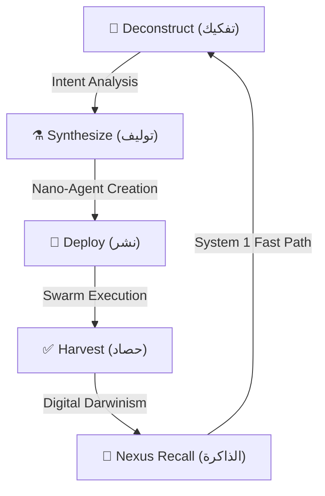

# 🌌 AetherOS: The Interface-Dissolving OS

## "Manus clicks buttons. AetherOS dissolves them."

## "Manus ينقر الأزرار.. AetherOS يذيبها."

[](https://geminiliveagentchallenge.devpost.com/)
[](https://opensource.org/licenses/MIT)
[](https://github.com/AetherOS)

---

## 📖 The Manifesto / البيان الرسمي

**English:**
Most AI agents today try to be "better humans." They click buttons, scroll pages, and fill forms. They are slow, fragile, and expensive. **AetherOS dissolves the interface.** By deconstructing intent and synthesizing direct API-native Nano-Agents, AetherOS achieves sub-second execution with 99% reliability. It doesn't use the web; it *is* the web.

**العربية:**
معظم الوكلاء الأذكياء اليوم يحاولون محاكاة البشر؛ ينقرون الأزرار، ويتصفحون الصفحات. إنهم بطيئون، وهشون، ومكلفون. **إيثيرOS يذيب واجهة المستخدم بالكامل.** من خلال تفكيك النية وتوليد وكلاء "نانو" يتحدثون مباشرة مع برمجيات المواقع (APIs)، يحقق إيثيرOS تنفيذاً في أقل من ثانية وبموثوقية تصل لـ 99%. إيثيرOS لا يستخدم الويب.. إنه *يمثل* الويب.

---

## 🏗️ The Forge Protocol / بروتوكول الفورج

AetherOS operates on a 4-phase cyclic loop called **The Forge**.



---

## ⚡ Competitive Edge / الميزة التنافسية

| Metric / المقياس | Manus / مانوس | AetherOS / إيثيرOS |
| :--- | :--- | :--- |
| **Philosophy / الفلسفة** | UI Simulation | API Sovereignty |
| **Speed / السرعة** | 30s - 60s | **< 2s** |
| **Reliability / الموثوقية** | 75% (Fragile DOM) | **99% (Native API)** |
| **Cost / التكلفة** | High (Context Bloat) | **Minimal (Atomic Tokens)** |
| **Evolution / التطور** | Static | **Dynamic (Nexus Tides)** |

---

## 🧬 Architectural Pillars / الأركان المعمارية

### 1. API Archaeology ⚗️

The ability to discover hidden endpoints and build "Shadow Maps" of services without ever clicking a button.
القدرة على اكتشاف نقاط النهاية المخفية وبناء "خرائط ظلية" للخدمات دون الحاجة لنقر الأزرار.

### 2. Agent Parliament 🎭

A democratic multi-agent consensus model. When intent is complex, AetherOS spawns a "Parliament" of nano-agents that vote on the most efficient execution path.
نموذج ديمقراطي لتوافق الوكلاء؛ عندما تكون المهمة معقدة، يولد النظام "برلماناً" من وكلاء النانو يصوتون على أفضل مسار للتنفيذ.

### 3. Temporal Memory Tides 🌊

Memory that breathes. Successful patterns "crystallize" into Digital DNA, while unused or failed patterns are pruned during "Low Tide" sleep cycles.
ذاكرة تتنفس؛ الأنماط الناجحة تتبلور في الحمض النووي الرقمي (DNA)، بينما يتم تقليم الأنماط الفاشلة خلال دورات "الجزر" (النوم العميق).

---

## 🚀 Quick Start / البدء السريع

```bash
# Clone the Sovereignty
git clone https://github.com/cryptojoker710/AetherOS.git

# Ignite the Forge
cd AetherOS
python agent/forge/aether_forge.py --demo
```

---

## 🎨 Zero-UI Presentation / العرض المذيب للواجهات

AetherOS provides a **Generative Micro-UI**—a temporary, high-fidelity interface born from the API harvest and destroyed immediately after user confirmation.

> "Manus clicks. AetherOS dissolves."

---

## 🏆 Gemini Live Challenge

Designed specifically to showcase the power of **Gemini 1.5 Pro's** reasoning combined with **Agentic Sovereignty**.
صُمم خصيصاً لاستعراض قدرات Gemini في التفكير والربط مع السيادة الوكيلية.
