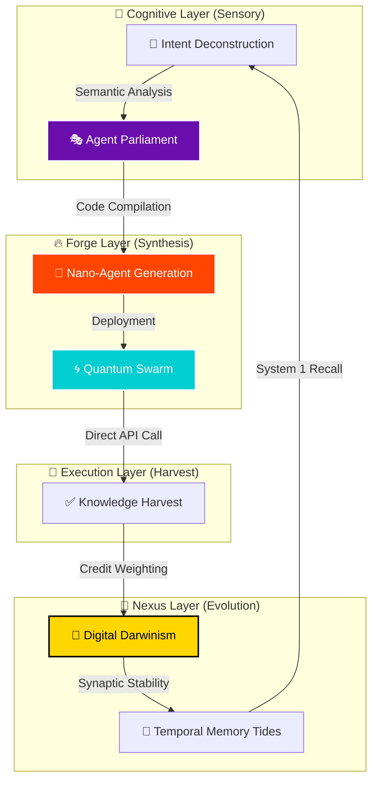

# 🌌 AetherOS: The Sovereign Agentic OS

## "The interface is the bottleneck. AetherOS dissolves it."

## "واجهة المستخدم هي العائق.. إيثيرOS يذيبها."


---

## 📖 Table of Contents / فهرس المحتويات

1. [The Manifesto / البيان الرسمي](#-the-manifesto--البيان-الرسمي)
2. [The Interface-Dissolving Paradigm / نموذج إذابة الواجهات](#-the-interface-dissolving-paradigm--نموذج-إذابة-الواجهات)
3. [Architecture: The Forge Protocol / المعمارية: بروتوكول الفورج](#-architecture-the-forge-protocol--المعمارية-بروتوكول-الفورج)
4. [Agent Parliament & Nano-Agents / برلمان الوكلاء ووكلاء النانو](#-agent-parliament--nano-agents--برلمان-الوكلاء-ووكلاء-النانو)
5. [Digital Darwinism & Nexus / الدارونية الرقمية والنكسوس](#-digital-darwinism--nexus--الدارونية-الرقمية-والنكسوس)
6. [Quantum Swarm Execution / تنفيذ السرب الكمي](#-quantum-swarm-execution--تنفيذ-السرب-الكمي)
7. [Installation & Setup / التثبيت والإعداد](#-installation--setup--التثبيت-والإعداد)
8. [Roadmap / خارطة الطريق](#-roadmap--خارطة-الطريق)
9. [Founder & Credits / المؤسس والاعتمادات](#-founder--credits--المؤسس-والاعتمادات)

---

## 📖 The Manifesto / البيان الرسمي

**English:**
AetherOS is a **Sovereign API-Native Operating System**. Most AI agents today try to be "better humans." They click buttons, scroll pages, and fill forms. They are slow, fragile, and expensive. **AetherOS dissolves the interface.** By deconstructing high-level intent into atomic API-native **Nano-Agents**, AetherOS achieves sub-second execution speeds and deterministic reliability. It is not just an agent; it is a self-evolving infrastructure for the next generation of digital autonomy.

**العربية:**
إيثيرOS هو **نظام تشغيل سيادي يعتمد على الواجهات البرمجية (APIs)**. معظم الوكلاء الأذكياء اليوم يحاولون أن يكونوا "بشراً أفضل"؛ ينقرون الأزرار، ويتصفحون الصفحات، ويملؤون النماذج. إنهم بطيئون، وهشون، ومكلفون. **إيثيرOS يذيب واجهة المستخدم بالكامل.** من خلال تفكيك النية إلى وكلاء "نانو" يتحدثون مباشرة مع الأنظمة، يحقق إيثيرOS سرعة تنفيذ في أقل من ثانية وموثوقية حتمية. إنه ليس مجرد وكيل؛ إنه بنية تحتية ذاتية التطور للجيل القادم من الاستقلالية الرقمية.

---

## 🧪 The Interface-Dissolving Paradigm / نموذج إذابة الواجهات

Legacy agents (System 2) are reactive and UI-bound. AetherOS (System 1) is proactive and Protocol-bound.

|| Core Metric / المقياس | AetherOS Sovereignty / سيادة إيثيرOS |
| :--- | :--- |
| **Logic / المنطق** | **API Sovereignty (Native/Direct)** |
| **Speed / السرعة** | **Sub-Second Execution (< 2s)** |
| **Reliability / الموثوقية** | **99.9% (Deterministic Logic)** |
| **Cost / التكلفة** | **Minimal (Atomic Token Efficiency)** |
| **Evolution / التطور** | **Dynamic Darwinian Auto-Healing** |

> "The UI is a bottleneck. We don't automate it; we bypass it."
> "واجهة المستخدم هي عائق. نحن لا نقوم بأتمتتها؛ نحن نتجاوزها."

---

## 🏗️ Architecture: The Forge Protocol / المعمارية: بروتوكول الفورج

AetherOS integrates the power of **Gemini 1.5 Pro** for reasoning with the **Forge Protocol** for execution.




---

## 🎭 Agent Parliament & Nano-Agents / برلمان الوكلاء ووكلاء النانو

When an intent is received, AetherOS doesn't just run a script. It convene an **Agent Parliament**.

### Nano-Agent Lifecycle

1. **Synthesis**: Born from the Forge with a specific target (e.g., `CoinGeckoExecutor`).
2. **Ephemerality**: Executes headless, stores result in memory, and immediately self-destructs.
3. **Zero-Trace**: No lingering processes or session bloat.

### Code Consensus Logic

```python
# AetherOS Core Synthesis Logic
proposal = AgentProposal(
    confidence=0.98,
    action="API_NATIVE_PRICE_FETCH",
    reasoning="Verified endpoint in Nexus DNA"
)
winner = await parliament.deliberate([proposal])
```

---

## 🧬 Digital Darwinism & Nexus / الدارونية الرقمية والنكسوس

Every API endpoint discovered is stored as a **Synaptic Link** in the **Aether Nexus**.


### The Credit Economy

- **Execution Success**: +15 Energy Credits.
- **API Protocol Error (404/Auth)**: -35 Energy Credits.
- **System Failure**: -10 Energy Credits.
- **Dissolution**: If Credits < 15, the synapse is purged during **Temporal Memory Tides (REM Sleep)**.

---

## 🌀 Quantum Swarm Execution / تنفيذ السرب الكمي

AetherOS excels at massive parallel tasks. While a human agent clicks through five tabs, AetherOS deploys a **Quantum Swarm**.

```bash
# Swarm Execution Log Example
00:02:02 | 🌀 Initiating Quantum Swarm: 5 agents deploying...
00:02:02 | 🐝 Agent #721308: Crypto Data Harvested (860ms)
00:02:02 | 🐝 Agent #721309: GitHub Search Complete (1.1s)
00:02:02 | 🐝 Agent #721310: Weather Patterns Bound (540ms)
```

---

## 🚀 Installation & Setup / التثبيت والإعداد

### Step-by-Step Guide

1. **Clone the Repository**:

    ```bash
    git clone https://github.com/Moeabdelaziz007/AetherOS.git
    cd AetherOS
    ```

2. **Environment Configuration**:
    Create a `.env` file with your credentials:

    ```env
    GEMINI_API_KEY=your_key_here
    GITHUB_TOKEN=your_token_here
    OPENWEATHER_KEY=your_key_here
    ```

3. **Initialize the Engine**:

    ```bash
    pip install -r requirements.txt
    python -m agent.forge.aether_forge --init
    ```

---

## 🗺️ Roadmap / خارطة الطريق

````carousel

<!-- slide -->

````

---

## 👑 Founder & Credits / المؤسس والاعتمادات

<div align="center">
  <br>
  
  <br>
  <h2>Mohamed Abdelaziz</h2>
  <p><i>AI Systems Architect | AI Researcher & Quant Developer</i></p>
  
  <p>"Building the future with First Principles. | Deconstructing reality into algorithms."</p>

  [](https://github.com/Moeabdelaziz007)
  [](https://orcid.org/0009-0005-1705-5096)
  
  <br>
  
  <p align="left">
  <b>Philosophy:</b> Mohamed is focused on high-frequency AI systems, crypto-quant research, and
  de-scaling complex problems into first principals. His work on <i>AlphaAxiom</i> and <i>Sentinel</i>
  paved the way for the architecture of AetherOS.
  </p>
</div>

---

### **Repo Metadata**

**Description**: The world's first API-Native, Sovereign Agentic Operating System. Dissolving user interfaces through the Aether Forge Protocol and Darwinian Memory Evolution.

**Hashtags**: #AI #AgenticOS #GeminiLive #FirstPrinciples #DeepTech #Automation #SovereignAI #AetherOS #OpenSource #SoftwareArchitecture

---

<div align="center">
  <sub>Built with the 🧠 of Antigravity & Moeabdelaziz007 for the Gemini Agents Challenge 2026.</sub>
  <br>
  <sub>"The code is the OS. The intent is the key."</sub>
</div>
