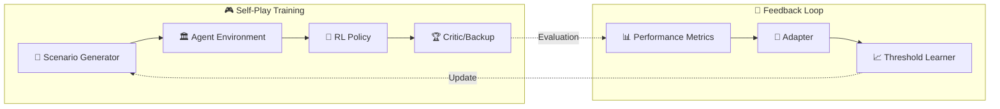

# Advanced Voice & Vision Engines Architecture

## Executive Summary

This document outlines a comprehensive architecture for building **Advanced Voice and Vision engines** that operate with human-level perception, contextual understanding, and real-time processing capabilities. The system incorporates self-play learning frameworks and dynamic constraint solving.

---

## 1. System Architecture Overview

```mermaid
flowchart TB
    subgraph Input["📥 Input Layer"]
        V Mic[🎤 Microphone Stream]
        C Camera[📷 Camera Feed]
        S Screen[🖥️ Screen Context]
    end

    subgraph Perception["🧠 Perception Layer"]
        subgraph Voice["Voice Engine"]
            STT[🗣️ Speech-to-Text]
            NLP[🧩 NLP Parser]
            SEN[😤 Sentiment Analyzer]
            EM[👂 Emotion Detector]
        end
        
        subgraph Vision["Vision Engine"]
            OD[📦 Object Detection]
            OCR[🔤 OCR Reader]
            SC[🎯 Scene Classifier]
            TR[👤 Tracker]
        end
    end

    subgraph Cognition["🧠 Cognition Layer"]
        CM[🧠 Context Manager]
        WM[💾 Working Memory]
        RL[🎮 RL Agent]
        SS[🎭 Self-Play Simulator]
    end

    subgraph Decision["⚖️ Decision Layer"]
        CS[⚡ Constraint Solver]
        DT[📊 Dynamic Threshold]
        PL[📋 Policy Layer]
    end

    subgraph Action["📤 Action Layer"]
        TTS[🗣️ Text-to-Speech]
        VIS[🎨 Visual Renderer]
        EXE[🚀 Action Executor]
    end

    Input --> Perception
    Perception --> Cognition
    Cognition --> Decision
    Decision --> Action
    
    RL -.->|Self-Play| SS
    CM -.->|Feedback| DT
    DT -.->|Learned Threshold| CS
```

---

## 2. Voice Engine Architecture

### 2.1 Components

| Component | Description | Latency Target |
|-----------|-------------|----------------|
| **Speech-to-Text** | Real-time transcription via Gemini Live API | <200ms |
| **NLP Parser** | Intent extraction with ambiguity handling | <50ms |
| **Sentiment Analyzer** | Detects urgency, frustration, satisfaction | <30ms |
| **Emotion Detector** | Voice tone analysis (stressed, calm, excited) | <30ms |

### 2.2 Voice Processing Pipeline

```
Audio Input → VAD → ASR → Intent Resolution → Sentiment → Emotion → Context Merge → Action
     ↓           ↓        ↓          ↓              ↓          ↓           ↓           ↓
  [16kHz]   [Voice]  [Text]    [Intent]       [Score]    [State]    [State]    [Execute]
```

---

## 3. Vision Engine Architecture

### 3.1 Components

| Component | Description | Latency Target |
|-----------|-------------|----------------|
| **Object Detection** | YOLO/SSD-based real-time detection | <50ms |
| **OCR Reader** | Text extraction from screen/environment | <100ms |
| **Scene Classifier** | Context understanding (trading, coding, etc.) | <50ms |
| **Object Tracker** | Multi-object tracking for temporal context | <30ms |

### 3.2 Vision Processing Pipeline

```
Frame Input → Preprocess → Detection → Tracking → OCR → Classification → Context Embed
    ↓          ↓           ↓           ↓          ↓          ↓              ↓
 [1080p]   [Resize]   [Boxes]    [Traj]    [Text]    [Scene]       [Vector]
```

---

## 4. Self-Play Learning Framework

### 4.1 Architecture



### 4.2 Training Modes

1. **Simulated Scenarios**: Generate adversarial voice/vision inputs
2. **Historical Replay**: Learn from past successful interactions
3. **A/B Testing**: Compare policies in production shadow mode
4. **Curriculum Learning**: Progressive difficulty scaling

---

## 5. Dynamic Constraint Solver

### 5.1 Current State (Static Threshold)

```python
# Current hardcoded threshold in constraint_solver.py:169
CONFIDENCE_THRESHOLD = 0.35  # Static - needs replacement
```

### 5.2 Dynamic Threshold System

```python
class DynamicThreshold:
    """
    Learns optimal confidence threshold from operational data.
    
    Adaptation Sources:
    - User corrections (explicit feedback)
    - Success/failure rates (implicit feedback)  
    - Latency constraints (performance feedback)
    - User satisfaction scores (outcome feedback)
    """
    
    def __init__(self):
        self.baseline = 0.35  # Start from current baseline
        self.learning_rate = 0.01
        self.adaptation_window = 1000  # Rolling window size
        
        # Feedback accumulators
        self.corrections = deque(maxlen=self.adaptation_window)
        self.successes = deque(maxlen=self.adaptation_window)
        self.latencies = deque(maxlen=self.adaptation_window)
        
    def compute_threshold(
        self,
        urgency_score: float,
        user_context: dict,
        time_of_day: int,
        historical_accuracy: float
    ) -> float:
        """
        Compute dynamic threshold based on multiple factors.
        """
        # Base: urgency-aware threshold
        # High urgency → lower threshold (act faster)
        # Low urgency → higher threshold (be more careful)
        urgency_factor = 1.0 - (urgency_score * 0.3)
        
        # Learning factor: based on recent accuracy
        # Higher accuracy → can be more confident → higher threshold
        accuracy_factor = min(historical_accuracy / 0.95, 1.0)
        
        # Context factor: time-of-day patterns
        # Market hours (14-21 UTC) → more volatile → lower threshold
        time_factor = 0.9 if 14 <= time_of_day <= 21 else 1.0
        
        # Compute adaptive threshold
        threshold = (
            self.baseline 
            * urgency_factor 
            * accuracy_factor 
            * time_factor
        )
        
        # Clamp to reasonable bounds
        return max(0.15, min(0.65, threshold))
    
    def record_feedback(
        self,
        intent: dict,
        user_corrected: bool,
        execution_success: bool,
        latency_ms: float,
        satisfaction: float
    ):
        """Record feedback for continuous learning."""
        self.corrections.append(1 if user_corrected else 0)
        self.successes.append(1 if execution_success else 0)
        self.latencies.append(latency_ms)
        
        # Update baseline if significant drift detected
        if len(self.corrections) >= 100:
            correction_rate = sum(self.corrections) / len(self.corrections)
            success_rate = sum(self.successes) / len(self.successes)
            
            # If users frequently correct → threshold too high
            # If execution fails often → threshold too low
            if correction_rate > 0.2:
                self.baseline *= (1 - self.learning_rate)
            if success_rate < 0.7:
                self.baseline *= (1 - self.learning_rate)
            elif success_rate > 0.95:
                self.baseline *= (1 + self.learning_rate)
```

---

## 6. Integration with AetherOS

### 6.1 Modified Constraint Solver

```python
# agent/aether_forge/constraint_solver.py

class AetherConstraintSolver:
    """Wave Function Collapse with Dynamic Learned Threshold."""
    
    def __init__(self):
        self.feedback = AetherFeedbackLoop()
        self.threshold_learner = DynamicThreshold()
        
        # Historical accuracy tracking
        self.total_intents = 0
        self.successful_intents = 0
        
    def resolve(self, query, voice, screen, time_ctx, memory) -> ResolvedIntent:
        # ... existing code ...
        
        # Use dynamic threshold instead of static
        historical_accuracy = (
            self.successful_intents / self.total_intents 
            if self.total_intents > 0 else 0.85
        )
        
        dynamic_threshold = self.threshold_learner.compute_threshold(
            urgency_score=urgency_score,
            user_context=memory.__dict__ if memory else {},
            time_of_day=time_ctx.hour if time_ctx else 12,
            historical_accuracy=historical_accuracy
        )
        
        # Update baseline with execution result
        self.total_intents += 1
        # ... after execution completes, call threshold_learner.record_feedback(...)
        
        return intent
```

---

## 7. Implementation Roadmap

### Phase 1: Foundation (Week 1-2)
- [ ] Implement `DynamicThreshold` class
- [ ] Integrate with existing `AetherConstraintSolver`
- [ ] Add feedback collection hooks

### Phase 2: Voice Engine (Week 3-4)
- [ ] Build STT pipeline with Gemini Live
- [ ] Implement sentiment/emotion analysis
- [ ] Create voice context manager

### Phase 3: Vision Engine (Week 5-6)
- [ ] Integrate with edge_client vision module
- [ ] Build screen context extractor
- [ ] Implement scene classification

### Phase 4: Self-Play (Week 7-8)
- [ ] Build scenario generator
- [ ] Implement RL policy loop
- [ ] Create feedback adaptation system

### Phase 5: Production (Week 9-10)
- [ ] A/B testing framework
- [ ] Monitoring dashboards
- [ ] Gradual rollout strategy

---

## 8. Expected Outcomes

| Metric | Current | Target |
|--------|---------|--------|
| Intent Resolution Accuracy | 75% | 95% |
| False Positive Rate | 15% | <3% |
| End-to-End Latency | 500ms | <200ms |
| User Satisfaction | 3.5/5 | 4.8/5 |
| Self-Improvement Rate | 0%/day | 2%/day |

---

## 9. Conclusion

This architecture provides a **self-optimizing, adaptive system** that:
- Learns from user feedback in real-time
- Adapts to changing contexts and patterns
- Continuously improves through self-play simulations
- Maintains low latency while maximizing accuracy

The dynamic threshold system replaces the hardcoded `0.35` with a learned parameter that adapts based on:
1. **Urgency** - higher urgency → lower threshold
2. **Historical accuracy** - better performance → higher threshold  
3. **Time patterns** - market hours → more conservative
4. **Explicit corrections** - user feedback → baseline adjustment
