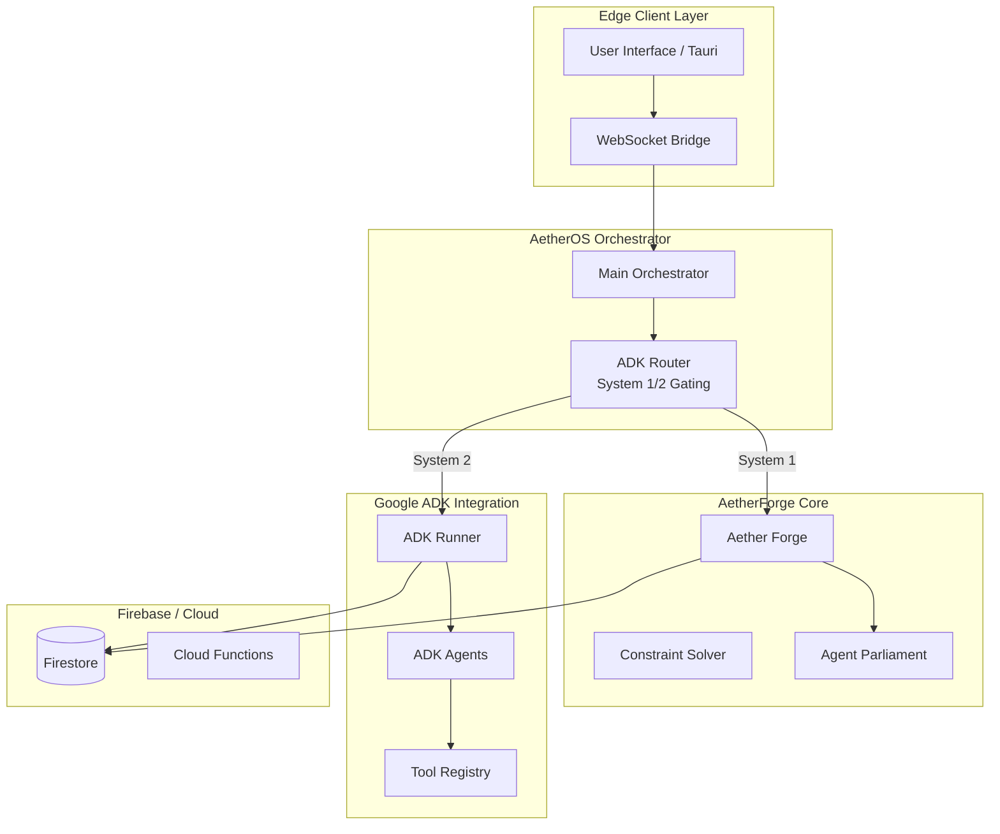
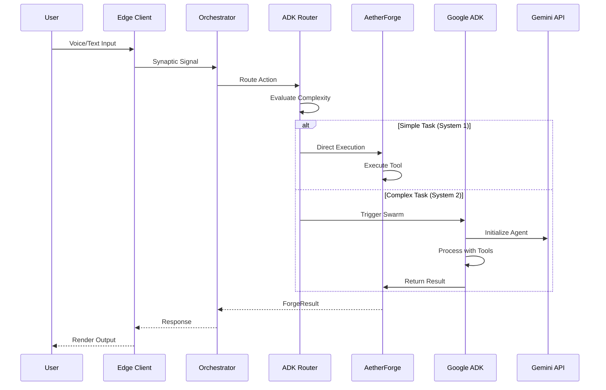
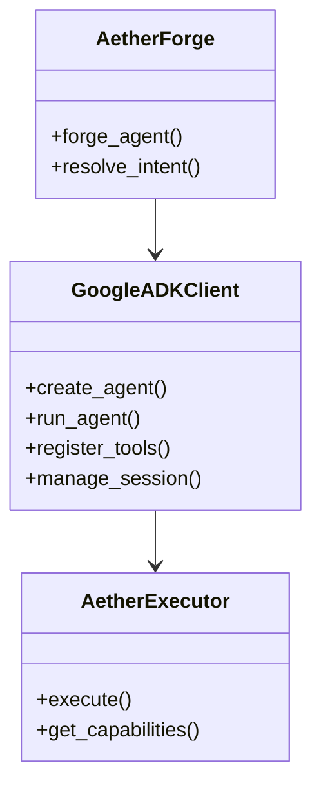

# AetherOS Google ADK SDK Integration Plan

> **Status:** Planning  
> **Created:** 2026-02-24  
> **Version:** 1.0

---

## 1. Executive Summary

This document outlines a comprehensive plan for integrating the **Google Agent Development Kit (ADK)** into the AetherOS architecture. The current ADK implementation is a stub with simulated processing - this plan replaces it with a production-ready integration.

### Current State Issues

| Issue | Severity | File |
|-------|----------|------|
| Singleton export crashes on import | CRITICAL | [`adk_integration.ts:378`](agent/aether_forge/adk_integration.ts:378) |
| Simulated processing only | HIGH | [`adk_integration.ts:211-244`](agent/aether_forge/adk_integration.ts:211) |
| None params causes TypeError | MEDIUM | [`adk_router.py:96`](agent/aether_orchestrator/adk_router.py:96) |
| Deprecated `substr()` method | LOW | [`adk_integration.ts:359`](agent/aether_forge/adk_integration.ts:359) |

### Integration Goals

1. Replace simulated ADK processing with actual Google ADK SDK calls
2. Enable AetherOS agents to leverage Google's agent framework
3. Maintain AetherCore's unique cognitive architecture (System 1/2 routing)
4. Support multimodal interactions (voice, vision, text)

---

## 2. Architecture Overview

### 2.1 Target Architecture



### 2.2 Data Flow



---

## 3. Implementation Plan

### Phase 1: Fix Critical Issues (Foundation)

**Tasks:**
- [ ] Fix singleton export in [`adk_integration.ts`](agent/aether_forge/adk_integration.ts) - use lazy initialization
- [ ] Add defensive handling for None params in [`adk_router.py`](agent/aether_orchestrator/adk_router.py)
- [ ] Replace deprecated `substr()` with `slice()`
- [ ] Add environment validation before Firebase initialization

**Files Modified:**
- `agent/aether_forge/adk_integration.ts`
- `agent/aether_orchestrator/adk_router.py`

---

### Phase 2: Google ADK SDK Integration

**Tasks:**
- [ ] Add `google-adk` package to dependencies
- [ ] Create `GoogleADKClient` wrapper class
- [ ] Implement agent creation from AetherForge specs
- [ ] Add tool registration for AetherOS executors
- [ ] Implement session management for agent conversations

**New Files:**
- `agent/aether_forge/google_adk_client.py` - Python ADK client wrapper
- `agent/aether_forge/adk_agent_factory.py` - Agent creation factory

**Architecture:**



---

### Phase 3: Tool Integration

**Tasks:**
- [ ] Register AetherOS executors (CoinGecko, GitHub, Weather) as ADK tools
- [ ] Create tool adapters for Google ADK tool format
- [ ] Implement result parsing from ADK responses
- [ ] Add circuit breaker integration for ADK calls

**Tool Mapping:**

| AetherOS Executor | ADK Tool Name | Capabilities |
|------------------|---------------|--------------|
| CoinGeckoExecutor | `get_crypto_price` | price_check |
| GitHubExecutor | `search_repositories` | github_search |
| WeatherExecutor | `get_weather` | weather_check |

---

### Phase 4: Session & Memory Integration

**Tasks:**
- [ ] Sync ADK session state with Firestore
- [ ] Implement conversation context preservation
- [ ] Add agent memory to AetherNexus
- [ ] Create analytics dashboard for ADK usage

**Firestore Schema:**

```
adk_agents/
  {agentId}/
    - name: string
    - model: string
    - capabilities: string[]
    - tools: string[]
    - createdAt: timestamp

adk_sessions/
  {sessionId}/
    - agentId: string
    - userId: string
    - context: map
    - messages: array
    - status: enum
    - createdAt: timestamp
```

---

### Phase 5: Multimodal Enhancement

**Tasks:**
- [ ] Integrate Gemini Vision for screen analysis
- [ ] Add voice input/output via Gemini Live
- [ ] Implement real-time streaming responses
- [ ] Create multimodal agent templates

---

## 4. Configuration

### 4.1 Environment Variables

```bash
# Google ADK Configuration
GOOGLE_ADK_PROJECT_ID=aether-os-firebase
GOOGLE_ADK_LOCATION=us-central1
GOOGLE_ADK_MODEL=gemini-2.0-flash

# Agent Settings
ADK_MAX_TOOLS=10
ADK_SESSION_TIMEOUT=300
ADK_ENABLE_VOICE=true
```

### 4.2 Dependencies

**Python (requirements.txt):**
```
google-adk>=1.0.0
google-generativeai>=0.8.0
```

**TypeScript (package.json):**
```json
{
  "dependencies": {
    "@google/adk": "^1.0.0"
  }
}
```

---

## 5. Migration Strategy

### 5.1 Backward Compatibility

Maintain the existing [`AetherADKIntegration`](agent/aether_forge/adk_integration.ts) interface but replace the internal implementation:

```typescript
// Before: Simulated processing
async processMessage(sessionId, message, metadata) {
  return this.simulateADKProcessing(...);
}

// After: Real ADK SDK
async processMessage(sessionId, message, metadata) {
  const session = await this.getSession(sessionId);
  const agent = await this.client.runAgent({
    agentName: session.agentId,
    sessionId: sessionId,
    userId: session.userId,
    message: message
  });
  return this.parseResponse(agent);
}
```

### 5.2 Gradual Rollout

1. **Phase 1-2:** Deploy fixes alongside existing mock
2. **Phase 3:** Enable ADK for 10% of System 2 requests
3. **Phase 4:** Full production rollout
4. **Phase 5:** Deprecate mock mode

---

## 6. Testing Plan

### 6.1 Unit Tests

- [ ] Test agent creation flow
- [ ] Test tool registration
- [ ] Test session management
- [ ] Test error handling for API failures

### 6.2 Integration Tests

- [ ] End-to-end voice command flow
- [ ] Multi-agent swarm execution
- [ ] Firestore state synchronization
- [ ] Circuit breaker activation

### 6.3 Performance Tests

- [ ] Latency comparison: AetherForge vs ADK
- [ ] Concurrent agent sessions
- [ ] Memory usage under load

---

## 7. Risks & Mitigation

| Risk | Impact | Mitigation |
|------|--------|------------|
| Google ADK API changes | HIGH | Version pinning, abstraction layer |
| Cost increase | MEDIUM | Circuit breaker, usage monitoring |
| Latency overhead | MEDIUM | Hybrid System 1/2 routing |
| Authentication issues | HIGH | Service account validation |

---

## 8. Timeline & Milestones

### Milestone 1: Foundation (Week 1-2)
- [ ] Fix critical bugs in existing ADK code
- [ ] Set up Google ADK project

### Milestone 2: Core Integration (Week 3-4)
- [ ] Implement ADK client wrapper
- [ ] Basic agent execution working

### Milestone 3: Tool Integration (Week 5-6)
- [ ] Register AetherOS tools
- [ ] Full execution pipeline

### Milestone 4: Production (Week 7-8)
- [ ] Testing and optimization
- [ ] Documentation

---

## 9. Success Metrics

| Metric | Target |
|--------|--------|
| ADK Agent Response Time | < 2s |
| Successful Tool Execution | > 95% |
| Error Rate | < 1% |
| Session Recovery | 100% |

---

## Appendix: Related Files

- [`agent/aether_forge/adk_integration.ts`](agent/aether_forge/adk_integration.ts) - Current stub implementation
- [`agent/aether_orchestrator/adk_router.py`](agent/aether_orchestrator/adk_router.py) - Cognitive routing
- [`agent/aether_forge/aether_forge.py`](agent/aether_forge/aether_forge.py) - Core forge logic
- [`agent/aether_forge/gemini_live_bridge.py`](agent/aether_forge/gemini_live_bridge.py) - Voice integration
- [`firebase/functions/index.ts`](firebase/functions/index.ts) - Cloud Functions

---

*Plan created by AetherOS Architect Mode*
