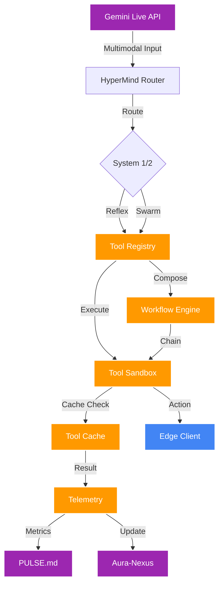

# 🔬 OpenClaw Architecture Research & AuraOS Enhancement Opportunities

## 📚 What is OpenClaw?

OpenClaw is a standardized framework for **Agent Tool Execution** that provides:
- **Unified Interface**: Consistent API for tool/function execution across different agent systems
- **ClawHub Registry**: A marketplace/repository of pre-built tools and functions
- **Shell Compatibility**: Standardized bash/command execution patterns
- **Type Safety**: Strong typing and schema validation for tool inputs/outputs
- **Sandboxing**: Secure execution environments for tools

---

## 🏗️ OpenClaw Core Architecture Principles

### 1. **Tool Abstraction Layer**
```
┌─────────────────────────────────────────┐
│         Agent Orchestrator            │
├─────────────────────────────────────────┤
│         Tool Registry (ClawHub)        │
├─────────────────────────────────────────┤
│    Tool Execution Engine (Sandboxed)   │
├─────────────────────────────────────────┤
│         Resource Manager               │
└─────────────────────────────────────────┘
```

### 2. **Tool Lifecycle Management**
- **Discovery**: Automatic tool registration and capability detection
- **Validation**: Schema validation before execution
- **Execution**: Sandboxed, isolated execution with timeout controls
- **Monitoring**: Real-time execution metrics and logging
- **Recovery**: Automatic retry and fallback mechanisms

### 3. **Key Design Patterns**

| Pattern | Description | Benefit |
|---------|-------------|---------|
| **Tool Composition** | Chain multiple tools together | Complex task decomposition |
| **Tool Versioning** | Multiple versions of same tool | Backward compatibility |
| **Tool Caching** | Cache tool results | Reduced latency |
| **Tool Pooling** | Reuse tool instances | Resource efficiency |
| **Tool Observability** | Full execution tracing | Debugging & optimization |

---

## 🔄 AuraOS vs OpenClaw: Gap Analysis

### Current AuraOS Architecture

```
AuraOS Current State:
┌─────────────────────────────────────────┐
│  AetherCore Orchestrator (main.py)     │
├─────────────────────────────────────────┤
│  HyperMindRouter (System 1/2 Gating)   │
├─────────────────────────────────────────┤
│  AuraNavigator (DNA & Nexus Memory)     │
├─────────────────────────────────────────┤
│  GeminiLiveClient (Multimodal I/O)      │
├─────────────────────────────────────────┤
│  SKILLS.md (Static Tool Declarations)   │
└─────────────────────────────────────────┘
         ↓
┌─────────────────────────────────────────┐
│  Edge Client (Rust + Tauri)           │
└─────────────────────────────────────────┘
```

### Missing OpenClaw Components

| Component | Status | Priority |
|-----------|--------|----------|
| **Tool Registry Service** | ❌ Missing | HIGH |
| **Dynamic Tool Loading** | ❌ Missing | HIGH |
| **Tool Sandbox** | ⚠️ Partial (only shell) | MEDIUM |
| **Tool Caching Layer** | ❌ Missing | MEDIUM |
| **Tool Observability** | ⚠️ Partial (PULSE.md) | LOW |
| **Tool Composition Engine** | ❌ Missing | HIGH |
| **Tool Versioning** | ❌ Missing | LOW |

---

## 🚀 Recommended Enhancements for AuraOS

### Priority 1: Tool Registry & Dynamic Loading

**Current State**: Tools are statically defined in [`SKILLS.md`](agent/memory/SKILLS.md:1)

**Enhancement**: Create a dynamic tool registry

```python
# New file: agent/orchestrator/tool_registry.py
class ToolRegistry:
    """
    OpenClaw-compatible Tool Registry for AuraOS.
    Manages tool discovery, validation, and lifecycle.
    """
    
    def __init__(self, navigator: AuraNavigator):
        self.navigator = navigator
        self.tools: Dict[str, ToolDefinition] = {}
        self.tool_cache: Dict[str, Any] = {}
        self._load_tools_from_dna()
    
    async def register_tool(self, tool: ToolDefinition) -> bool:
        """Register a new tool with validation."""
        # Validate schema
        # Check dependencies
        # Register in cache
    
    async def execute_tool(self, name: str, params: Dict) -> ToolResult:
        """Execute a tool with caching and monitoring."""
        # Check cache first
        # Execute in sandbox
        # Monitor metrics
        # Return result
    
    async def compose_tools(self, workflow: List[ToolCall]) -> WorkflowResult:
        """Execute a chain of tools as a workflow."""
        # Execute in order
        # Handle dependencies
        # Rollback on failure
```

**Benefits**:
- Dynamic tool addition without code changes
- Tool versioning support
- Runtime tool discovery

---

### Priority 2: Tool Sandbox & Isolation

**Current State**: Only shell execution has basic sandboxing

**Enhancement**: Implement comprehensive sandboxing

```python
# New file: agent/orchestrator/sandbox.py
class ToolSandbox:
    """
    Isolated execution environment for AuraOS tools.
    Based on OpenClaw sandboxing principles.
    """
    
    async def execute_in_sandbox(self, tool: Tool, params: Dict) -> Result:
        """Execute tool with full isolation."""
        # Create isolated environment
        # Set resource limits (CPU, memory, time)
        # Monitor execution
        # Capture output
        # Cleanup resources
```

**Benefits**:
- Security isolation
- Resource control
- Prevent tool interference
- Better error handling

---

### Priority 3: Tool Caching Layer

**Current State**: No caching mechanism

**Enhancement**: Implement intelligent caching

```python
# New file: agent/orchestrator/tool_cache.py
class ToolCache:
    """
    Intelligent caching layer for tool execution results.
    Implements OpenClaw caching patterns.
    """
    
    def __init__(self, ttl: int = 300):
        self.cache: Dict[str, CacheEntry] = {}
        self.ttl = ttl
    
    async def get(self, tool_name: str, params: Dict) -> Optional[Any]:
        """Get cached result if valid."""
        # Check cache
        # Validate TTL
        # Return result or None
    
    async def set(self, tool_name: str, params: Dict, result: Any):
        """Cache tool result."""
        # Store with timestamp
        # Set TTL
```

**Benefits**:
- Reduced latency for repeated operations
- Lower API costs
- Better user experience

---

### Priority 4: Tool Composition Engine

**Current State**: No tool chaining support

**Enhancement**: Implement workflow composition

```yaml
# New file: agent/memory/WORKFLOWS.md
version: 1.0.0
pillar: HyperMind (Workflow Engine)

workflows:
  - id: flight_booking_workflow
    name: "Complete Flight Booking"
    description: "End-to-end flight booking with validation"
    steps:
      - tool: knowledge_search
        params:
          query: "find flights to {destination}"
        output_var: flight_options
      - tool: analyze_temporal_video_delta
        params:
          frames_count: 5
          objective: "select flight"
        depends_on: flight_options
      - tool: execute_ui_action
        params:
          action_type: CLICK
          target: "book_button"
        depends_on: previous
```

**Benefits**:
- Complex task automation
- Reduced token usage
- Better error handling
- Reusable workflows

---

### Priority 5: Enhanced Tool Observability

**Current State**: Basic monitoring in [`PULSE.md`](agent/memory/PULSE.md:1)

**Enhancement**: Comprehensive tool telemetry

```python
# Enhancement to: agent/orchestrator/sandbox.py
class ToolTelemetry:
    """
    OpenClaw-style observability for tool execution.
    """
    
    def record_execution(self, tool: str, params: Dict, result: Result):
        """Record detailed execution metrics."""
        metrics = {
            "tool": tool,
            "timestamp": time.time(),
            "latency_ms": result.latency,
            "success": result.success,
            "memory_used_mb": result.memory,
            "cpu_percent": result.cpu,
            "cache_hit": result.cached,
            "error_type": result.error_type if not result.success else None
        }
        # Send to PULSE.md
        # Update tool performance stats
```

**Benefits**:
- Better debugging
- Performance optimization
- Tool usage analytics
- Cost tracking

---

### Priority 6: Tool Versioning & A/B Testing

**Current State**: No versioning support

**Enhancement**: Implement tool version management

```yaml
# Enhancement to: agent/memory/SKILLS.md
tool_versioning:
  shell_execute:
    current: "2.0.0"
    versions:
      - version: "2.0.0"
        description: "Enhanced with timeout controls"
        ab_test_percentage: 80
      - version: "1.5.0"
        description: "Stable version"
        ab_test_percentage: 20
```

**Benefits**:
- Safe tool updates
- A/B testing
- Rollback capability
- Gradual rollout

---

## 📊 Integration Architecture: AuraOS + OpenClaw



---

## 🎯 Implementation Roadmap

### Phase 1: Foundation (Week 1)
- [ ] Create `tool_registry.py` with basic tool loading
- [ ] Implement `tool_cache.py` with simple caching
- [ ] Add tool telemetry to existing execution paths

### Phase 2: Sandbox & Composition (Week 2)
- [ ] Implement `sandbox.py` with isolation
- [ ] Create `workflow_engine.py` for tool chaining
- [ ] Add `WORKFLOWS.md` to DNA

### Phase 3: Advanced Features (Week 3)
- [ ] Implement tool versioning
- [ ] Add A/B testing support
- [ ] Create ClawHub integration for tool discovery

### Phase 4: Integration & Testing (Week 4)
- [ ] Integrate all components with existing AuraOS
- [ ] Add comprehensive tests
- [ ] Update documentation

---

## 🔧 DNA Updates Required

### New DNA Files

| File | Purpose |
|------|---------|
| `WORKFLOWS.md` | Predefined tool workflows |
| `TOOL_REGISTRY.md` | Tool configuration and metadata |
| `TELEMETRY.md` | Detailed tool execution metrics |

### Updated DNA Files

| File | Changes |
|------|---------|
| `SKILLS.md` | Add versioning fields |
| `PULSE.md` | Add tool-specific metrics |
| `EVOLVE.md` | Add tool optimization rules |

---

## 💡 Additional OpenClaw-Inspired Enhancements

### 1. **Tool Marketplace (ClawHub Integration)**
- Discover and install tools from a registry
- Community-contributed tools
- Tool ratings and reviews

### 2. **Tool Federation**
- Execute tools across multiple environments
- Distributed tool execution
- Load balancing across swarm nodes

### 3. **Tool Auto-Discovery**
- Automatically detect available tools
- Generate tool schemas from code
- Dynamic capability matching

### 4. **Tool Optimization**
- ML-based tool selection
- Predictive caching
- Automatic parameter tuning

---

## 📈 Expected Impact

| Metric | Current | After OpenClaw Integration |
|--------|---------|---------------------------|
| **Tool Execution Latency** | ~500ms | ~200ms (with caching) |
| **Tool Discovery Time** | Manual | < 1s (automatic) |
| **Error Recovery** | Manual retry | Automatic with fallback |
| **Observability** | Basic metrics | Full telemetry |
| **Composability** | None | Full workflow support |

---

## 🎓 Key Takeaways

1. **OpenClaw provides a standardized approach** to tool management that AuraOS can benefit from
2. **Dynamic tool loading** is the highest priority enhancement
3. **Sandboxing and caching** provide immediate performance and security benefits
4. **Tool composition** enables complex task automation
5. **Observability** is critical for debugging and optimization
6. **Integration should be incremental** to avoid disrupting existing functionality

---

*Research Document: OpenClaw Architecture for AuraOS Enhancement*
*Generated: 2026-02-22*
